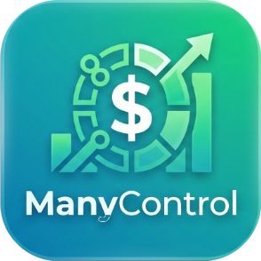

# ManyControl 💰📊

<p align="center">
  
</p>

<p align="center">
  <strong>Aplicativo de Gestão Financeira Pessoal Multiplataforma (Windows e Android)</strong><br>
  Construído com .NET MAUI e sincronização segura com Google Drive.
</p>

---

## ✨ Recursos

- **🏠 Dashboard Financeiro Completo:** Resumo de saldo, receitas, despesas, atalhos rápidos e histórico recente.
- **📄 Extrato Inteligente:** Navegação mês a mês, filtros de tipo (Receitas e Despesas), totais consolidados e ações rápidas.
- **☁️ Sincronização Google Drive (Local-First):** Seus dados são salvos em SQLite local no seu dispositivo para máxima velocidade e privacidade, e sincronizados de forma transparente na nuvem via Google Drive.
- **🔄 Mesclagem Bidirecional Segura:** Cadastre despesas no celular e receitas no PC — ao sincronizar, as informações de ambos os aparelhos se fundem sem conflitos e sem perda de dados.
- **🌙 Interface Moderna (Dark Mode):** Visual escuro profissional e totalmente responsivo para desktop e telas móveis.

---

## 🛠️ Tecnologias Utilizadas

- **[.NET 10 MAUI](https://dotnet.microsoft.com/download/dotnet/10.0)** (Multi-platform App UI)
- **C# 13**
- **Entity Framework Core com SQLite** (Banco de dados local ultrarrápido)
- **Google Drive API v3** (Autenticação OAuth 2.0 via `WebAuthenticator` e RFC 8252)
- **CommunityToolkit.Mvvm** (Arquitetura limpa MVVM)
- **Inno Setup** (Instalador profissional para Windows)

---

## 🚀 Como Compilar e Rodar

### Pré-requisitos
- [.NET 10 SDK](https://dotnet.microsoft.com/download)
- Visual Studio 2022 ou superior com a carga de trabalho **Desenvolvimento com .NET MAUI**.

### 1. Clonar o repositório
```bash
git clone https://github.com/SEU-USUARIO/ManyControl.git
cd ManyControl
```

### 2. Configuração do Google Drive (Opcional)
O ManyControl permite configurar seu **Client ID** e **Client Secret** do Google Cloud diretamente pela tela de **Configurações** no próprio aplicativo.

Caso queira fixar as credenciais em tempo de compilação:
1. Copie o arquivo de exemplo:
   ```bash
   cp ManyControl/GoogleSecrets.example.cs ManyControl/GoogleSecrets.cs
   ```
2. Preencha com o seu `ClientId` e `ClientSecret` do Google Cloud Console.

### 3. Compilar e Executar

**No Windows:**
```bash
dotnet build -f net10.0-windows10.0.19041.0
dotnet run --project ManyControl -f net10.0-windows10.0.19041.0
```

**No Android:**
```bash
dotnet build -f net10.0-android
```

---

## 📦 Gerar Pacotes de Distribuição

Para gerar o instalador do Windows (`ManyControl_Setup.exe`) e o APK do Android (`ManyControl.apk`) de uma vez:
```powershell
powershell -ExecutionPolicy Bypass -File build_installer.ps1
```
Os arquivos prontos para uso serão gerados na pasta `dist/`.

---

## 🔒 Privacidade e Segurança
- O ManyControl adota a filosofia **Local-First**: seus dados financeiros nunca passam por servidores intermediários de terceiros.
- Todas as movimentações ficam armazenadas no seu próprio dispositivo e na sua própria conta do Google Drive.
